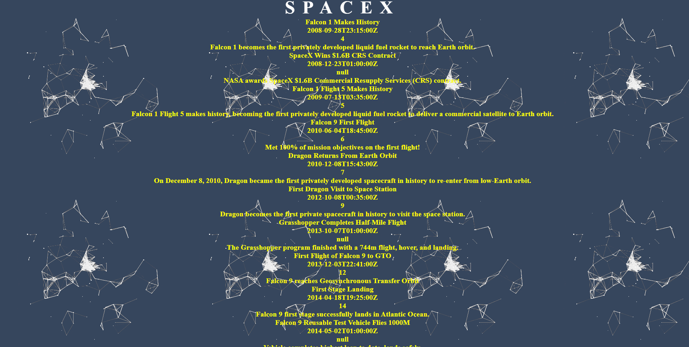

# SpaceX-API

An API project that pulls history information from the SpaceX API. Fetches JSON data from API. Incorporated Async/Await functions. Applicated created with JavaScript, HTML, and CSS. Deployed using Firebase

